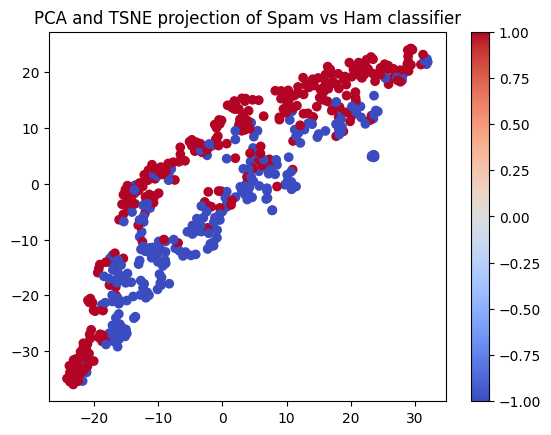
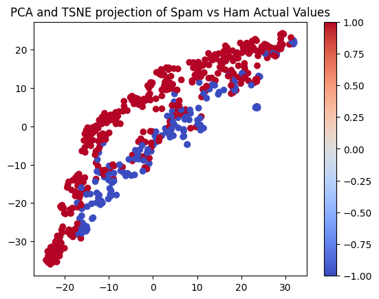

# Support Vector Machines and Natural Language Processing for Spam versus Ham Classification
This an implementation of multiple types of Support Vector Machines (SVM) for classifying spam versus ham. For the models, I used the enron1 dataset .
## Table of Contents
- [Plan](#Plan)
- [Part 1](#part1)
- [Next Steps](#NextSteps)
- [License](#license)

## Plan
I am building this project for educational purposes, so I will build multiple SVMs and work my way from the most naive (Hard-Margin) to more sophisticated methods
like a RBF kernel SVM. I chose to apply SVMS to Email spam classification because I wanted to learn some natural language processing on top of supervised learning. I plan on using this project to also help me refine my skills in natural language processing. 
  
More concretely my plan is as follows:

Part          | Description   | Status
------------- | ------------- | -----------
1             | Hard Margin SVM using Gradient Descent             | DONE
2             | Soft Margin SVM using Stochastic Gradient Descent  | TODO
3             | RBF kernel SVM using QP solver                     | TODO

For Natural Language Processing I started with a Bag of Words model and will integrate different types of NLP models to see which one is best suited for this learning task.  
  
I will not use any libraries other than Numpy and built-in libraries for the construction of the models as I want to learn to build everything from scratch. I will supplement each model (built in a Jupyter notebook) with a LaTeX write up that goes through the mathematical details of the model construction.

## Part 1
My first model is a hard margin support vector machine implementing using gradient descent. 

In its first pass I used a Bag of Words model to embed each email datapoint as a feature vector. The frequency of certain words like "The" or "a" made my optimization step a bit chaotic, so I decided to forego storing the exact counts of each word and instead track the presence or absence of the word in the email, which greatly improved the optimization. I go through the derivations for the optimization step in the LaTeX, but in essence I used the method of Lagrange multipliers to maximize the margin width of the SVM under the prediction constraint. Gradient descent was used to approximate the multiplier vector L then the parameters of the prediction function were recovered from L.

From here, I made predictions where Ham had a target of 1 and Spam had a target of -1. I applied lossy compression on the data to visualize the SVM's classification:

This can be compared to the plot of the Emails and their actual labels:

While there is some clear discrepancies in the plots, for a naive classifaction algorithm I am happy with the result. However, based on more detailed analysis, the model had 84% accuracy on the test dataset with a slight tendency towards false positives. Thus, there is a clear direction for improvement.

## Part 2
Currently Working On it ;)

## License
This project is licensed under the [MIT License](LICENSE).
s